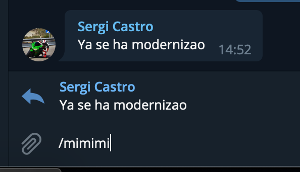

# Mimimizer bot


Stupid Telegram bot that will "mimimize" a text.

Supports 2 modes:

### Inline mode

The bot will attend queries sent to it. The query result will just be the mimimized text of what you typed.


### `mimimi` command

The `/mimimi` command can be used in reply to a message, so that originaln message is "mimimized" and returned to the conversation. If the bot is group admin or has permissions to delete messages, the command message is deleted to freak out other users :)




## Running

The first thing you need is to create a [Telegram bot](https://core.telegram.org/bots/faq#how-do-i-create-a-bot) since you will need its token.

The inline mode will work out of the box, but for the command mode you will need to [disable bot privacy mode](https://core.telegram.org/bots/faq#what-messages-will-my-bot-get). Also, for the delete message to work, the bot needs to have permissions to delete messages in the group (making it group admin works). If the bot is not admin it will not be able to delete the command message, but it will work the same.

### Heroku vs local

If running in local, the bot will try to load a `.env` file to read the Telegram API token. If the file does not exist the boot continues to try to read the token from the `TB_KEY` env var. If it does not exist it will fail and quit. In Heroku you need to set this via the `heroku config:set` command.

Also, it seems Heroku no longer populates the public URL of the app to the app itself so you will need to set `PUBLIC_URL` env var so that the the bot listens in the appropriate webhook URL. Note that if you plan to run the bot in Heroku you will need to set the hook URL in the Telegram bot. For that you will need to run the following request:

```
$ curl -v https://api.telegram.org/bot{bot_token}/setWebhook?url={webhook_url}
```

You can verify the settings with the call:

```
$ curl -v https://api.telegram.org/bot{my_bot_token}/getWebhookInfo
```
